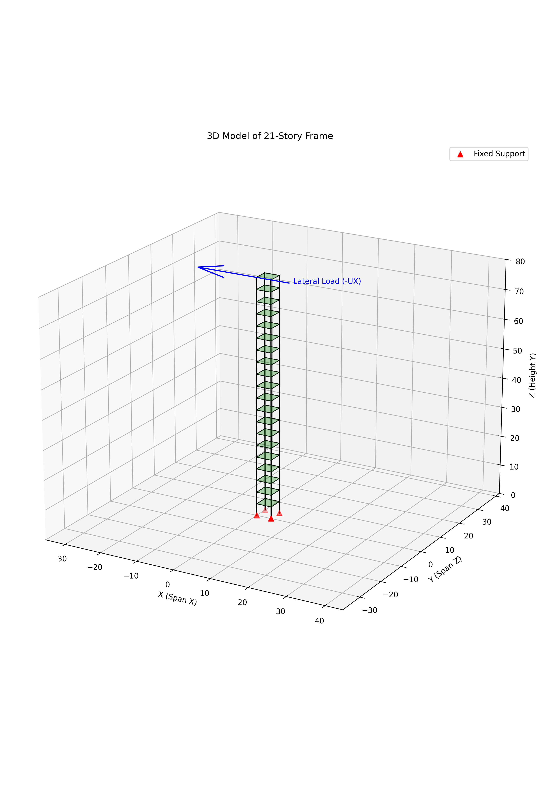

# 20-Story 3D Frame OpenSeesPy Analysis

This project performs a structural analysis of a 20-story 3D moment-resisting frame using [OpenSeesPy](https://openseespydoc.readthedocs.io/en/latest/).

## Scripts

### 1. `three_story_20_static.py`
Performs **Static and Modal Analysis**.
- **Loads:**
    - Gravity: Distributed floor load (-5 kN/m²).
    - Lateral: Point load at top floor (-3000 kN, UX).
- **Outputs:**
    - `three_story_20_static_displacements.csv`
    - `three_story_20_static_reactions.csv`
    - `three_story_20_static_modal.csv`

> This script shares model defaults with `three_story_20_common.py`:
> `NUM_STORIES = 20`, `FLOOR_HEIGHT = 4.0`, `SPAN_X = 4.0`, `SPAN_Z = 4.0`,
> `POINT_LOAD_VALUE = -3000`, `FLOOR_LOAD_PRESSURE_KPA = -5`.

### 2. `three_story_20_dynamic.py`
Performs **Dynamic Time-History Analysis**.
- **Loads:**
    - Gravity: Distributed floor load (-5 kN/m²).
    - **No Lateral Point Load**.
    - Ground Motion: Uniform Excitation (0.3g sine pulse).
- **Process:**
    1. Apply Gravity Loads -> Analyze -> Fix Loads (`loadConst`).
    2. Apply Ground Motion -> Analyze (Transient).
- **Outputs:**
    - `three_story_20_dynamic_top.csv`
    - `three_story_20_dynamic_story_drift.csv`

> This script shares model defaults with `three_story_20_common.py` and `three_story_20_opensees.py`.

### 3. `visualize_structure.py`
Generates a 3D matplotlib rendering of the structure.
- **Output:** `structure_view_3d.png`
- **Visualization:** Black frame, Green semi-transparent slabs, Red supports, Blue lateral load arrow.



### 4. `three_story_20_common.py`
Shared configuration constants and helpers used by the three scripts:
- story/geometry defaults
- section property computation (`section_properties`)
- floor load generation (`floor_loads`)
- conversion from number of stories to model levels (`level_count`)

### 5. `visualize_openseespy.py`
Uses `vfo` (Visualization for OpenSees) to generate a native interactive 3D model plot.
- **Requires:** `vfo` library (installed).
- **Output:** Interactive window showing the OpenSeesPy model.

## Model Description

- **Geometry:** 20 Stories (21 Levels), 4m height/story, 4m x 4m plan.
- **Section:** 1.0m x 1.0m Square Column/Beam.
- **Material:** E=2.0e7 kPa, nu=0.167.

## Usage

Run the desired analysis script using Python:

```bash
# Static Analysis
python three_story_20_static.py

# Dynamic Analysis
python three_story_20_dynamic.py
```

*Note:* Use an x86_64 environment on macOS Apple Silicon if `openseespy` fails to import.

## Environment setup

This repository does not include virtual environment directories.  
Create local environment and install dependencies when cloning on a new machine:

```bash
cd /path/to/3D_Frame_FEM/openseespy
python -m venv .usr_venv
source .usr_venv/bin/activate   # Windows: .usr_venv\\Scripts\\activate
python -m pip install --upgrade pip
pip install openseespy numpy matplotlib scipy
```

### Conda environment (recommended)

```bash
cd /path/to/3D_Frame_FEM/openseespy
conda env create -f environment.yml
conda activate three-story-openseespy
```

### Pip requirements file

```bash
cd /path/to/3D_Frame_FEM/openseespy
python -m venv .usr_venv
source .usr_venv/bin/activate   # Windows: .usr_venv\\Scripts\\activate
pip install -r requirements.txt
```

Optional visualization package:

```bash
pip install vfo  # only if using visualize_openseespy.py
```

For OpenSeesPy import issues on macOS Apple Silicon, use a compatible x86_64 Python environment.
