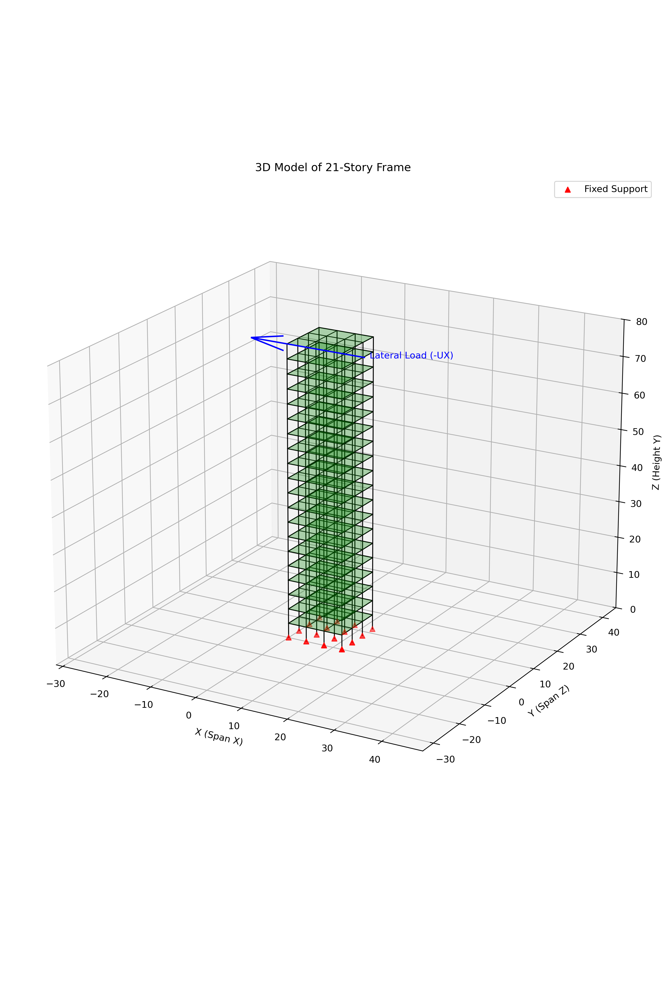

# 3D_Frame_FEM 저장소 요약

## 프로젝트 개요

이 저장소는 MATLAB 기반의 2D/3D 구조해석 FEM 예제와, 이를 OpenSeesPy로 확장한 3차원 프레임 해석 실험을 함께 담고 있습니다.

현재 작업의 중심은 `three_story_20/` 및 `openseespy_scripts/` 폴더에 있는 20층 3D 프레임 모델이며, 다음 내용을 다룹니다.

- 3차원 프레임 강성/질량 행렬 조립
- 강체 바닥(rigid diaphragm) 제약
- 정적 해석
- 고유진동수 해석
- 지반가속도 입력 기반 동적 응답
- OpenSeesPy 기반 비교 모델

## 폴더 구성

### 루트

- `ThreeDimFrame.m`: 기본 3D 프레임 샘플
- `ThreeDimFrame_2.m`: 소규모 3D 프레임 예제
- `ThreeDimFrame_12_18.m`: 중간 단계 실험 스크립트
- `drawingMesh.m`, `loading.m`: 시각화 및 하중 보조 함수
- `readme.md`: 저장소 개요 문서

### `three_story_20/`

MATLAB 기반 20층 프레임 해석 예제입니다.

- `ThreeDimFrame_20story.m`: 정적 해석 및 모드 해석
- `ThreeDimFrame_20story_ode45.m`: ODE45 기반 동적 응답
- `utils/build3DFrameGeometry.m`: 다경간 3D 프레임 형상 생성
- `utils/assemble3DFrameMatrices.m`: 강성/질량/하중 조립
- `utils/applyRigidDiaphragmConstraints.m`: 강체 바닥 제약 적용
- `utils/frameSectionProperties.m`: 단면 특성 계산

### `openseespy_scripts/`

OpenSeesPy 기반 20층 프레임 해석 예제입니다.

- `three_story_20_static.py`: 정적 해석 및 모드 해석
- `three_story_20_dynamic.py`: 동적 시간이력 해석
- `three_story_20_opensees.py`: 통합 OpenSeesPy 예제
- `three_story_20_common.py`: 공통 상수 및 보조 함수
- `README.md`: 영문 문서
- `readmekr.md`: 한글 문서

### `Problem/`

교재형 문제 풀이 스크립트 모음입니다.

### `matlab_codes_fem_book/`

재사용 가능한 FEM 라이브러리 함수 모음입니다.

## 현재까지 진행한 사항

2026-03-17 기준으로 다음 작업을 반영했습니다.

- MATLAB 강체 바닥 제약식의 부호/수식 일관성을 정리
- 단면 특성 계산을 `frameSectionProperties.m`로 공통화
- OpenSeesPy 정적/동적 스크립트의 `E` 전달 버그 수정
- OpenSeesPy 반력 CSV가 0으로 저장되던 문제 수정
  - `ops.reactions()` 호출 후 `nodeReaction()`을 기록하도록 변경
- OpenSeesPy 문서를 영어/한글로 분리
  - `openseespy_scripts/README.md`
  - `openseespy_scripts/readmekr.md`
- 기존 단일경간 모델을 다경간 모델로 확장
  - 현재 기본값: `3 x 3 bays`
  - 기본 경간 간격: `4.0 m x 4.0 m`
  - 전체 평면 크기: `12.0 m x 12.0 m`
- OpenSeesPy 시각화 스크립트를 다경간 형상에 맞게 갱신

## 현재 기본 모델 메모

- 층수: 20 stories
- OpenSeesPy 모델 level 수: 21 (base 포함)
- 기본 경간 수: `NUM_BAYS_X = 3`, `NUM_BAYS_Z = 3`
- 재료: `E = 2.0e7 kPa`, `nu = 0.167`
- 단면: `1.0 m x 1.0 m`
- 하중 단위: `kN`
- 길이 단위: `m`

## 현재 구조 형상

아래 이미지는 현재 기본 다경간 모델(`3 x 3 bays`)을 시각화한 결과입니다.



## 실행 예시

### MATLAB

1. `three_story_20` 폴더로 이동
2. 정적 해석: `ThreeDimFrame_20story`
3. 동적 해석: `ThreeDimFrame_20story_ode45`

### OpenSeesPy

`openseespy_scripts` 폴더에서 실행합니다.

```bash
python three_story_20_static.py
python three_story_20_dynamic.py
```

## 결과 파일

OpenSeesPy 결과는 주로 `openseespy_scripts/results/` 아래에 저장됩니다.

- `three_story_20_static_displacements.csv`
- `three_story_20_static_reactions.csv`
- `three_story_20_static_modal.csv`
- `three_story_20_dynamic_top.csv`
- `three_story_20_dynamic_story_drift.csv`

MATLAB 결과는 `three_story_20/results/` 아래에 저장됩니다.

## 라이선스

라이선스는 `LICENSE` 파일을 참고하세요.

---

최종 갱신일: 2026-03-17
